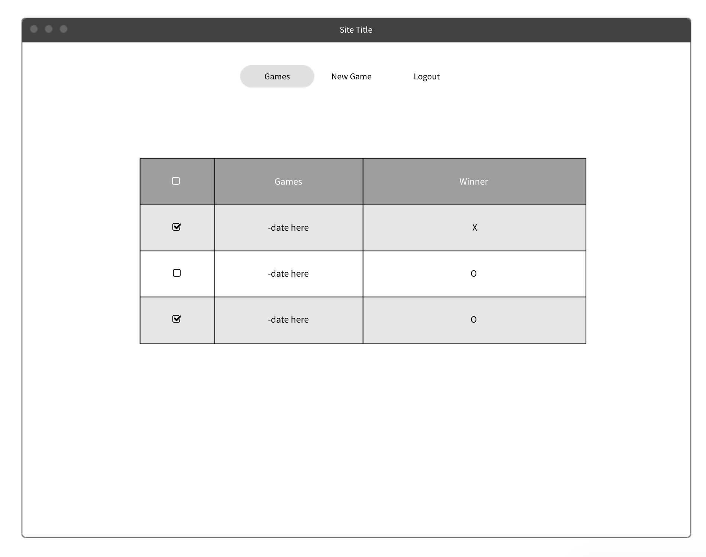

## Play Colleen's Game aka Tic Tac Toe

Check it out!

https://cmd08010.github.io/colleens-game/

## About

Colleen's Game is a fun game of Tic Tac Toe that users can play online. Users can switch between X and O to have a fun time playing.

## Planning Stories

The project was a great challenge to determine how to complete the game logic and make a fun user experience. I followed the suggested schedule and began with authentication and then moved on to the game logic. From there, the styling was completed.

### Technologies used

Javascript, jQuery and HTML were used to create the game logic and user facing experience. I utilized ajax requests with a preset API to same user and game data. Finally I used CSS for styling.

* jQuery
* HTML/CSS
* Bootstrap
* Javascript

## User Stories

   * As a user, I want to be able to sign up
   * As a user, I want to be able to sign in
   * As a user, I want to be able to change password
   * As a user, I want to be able to sign out
   * As a user, I want to be able to start a tic tac toe game
   * As a user, I want to be able to start as X and then rotate between X and O
   * As a user, I want to be only select available spaces on the board
   * As a user, I want to be notified when win, loss or tie occurs
   * As a user, I want to not be able to add to that board once the game is finished
   * As a user, I want to be able to play again
   * As a user, I want to be to view number of games played

## Wireframes

## Unsolved Problems

I would like to make the site mobile friendly. I would also like to incorporate more graphics and improve the styling.
